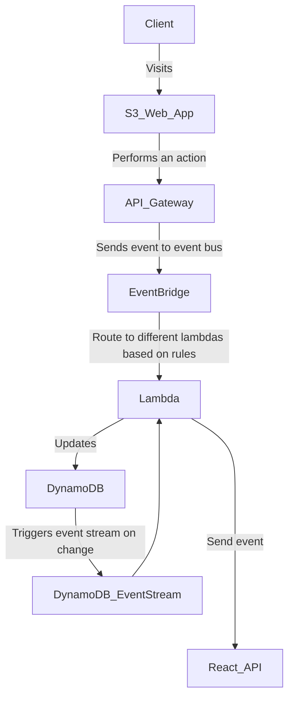

# dealmaker

```mermaid
    flowchart TD
    Client --> |Visits| S3_Web_App
    S3_Web_App --> |Performs an action| API_Gateway
    API_Gateway --> |Sends event to event bus| EventBridge
    EventBridge --> |Route to different lambdas based on rules| Lambda
    Lambda --> |Updates| DynamoDB
    DynamoDB --> |Triggers event stream on change| DynamoDB_EventStream
    DynamoDB_EventStream --> Lambda
    Lambda ----> |Send event|React_API
```